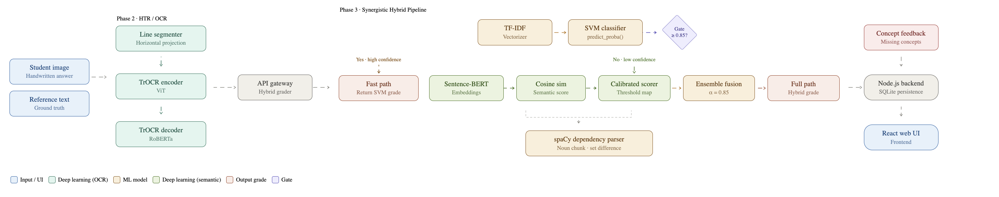

# Automated EdTech Grading Assistant

**Domain:** Document AI + NLP + Education Technology  
**Objective:** An end-to-end pipeline for digitizing unconstrained handwritten student answers and evaluating them for semantic and factual correctness against reference solutions.

---

## 🏗️ System Architecture

The following diagram illustrates the final end-to-end flow from a handwritten image to a final grade and pedagogical feedback, utilizing our Synergistic Hybrid pipeline.



---

## 🔬 Project Evolution

This capstone project evolved over three distinct developmental phases to iteratively solve critical challenges in automated semantic grading:

### Phase 1: Classical ML Baseline (Lexical Approach)
* **Architecture:** Tesseract OCR + TF-IDF Vectorization + Logistic Regression.
* **Outcome:** Established a functional baseline with a Macro F1 of 0.5732 on familiar topics.
* **Limitation:** Suffered from severe **lexical brittleness**. The model memorized specific domain vocabulary and failed to generalize to unseen scientific domains, systemically penalizing students who used correct synonyms.

### Phase 2: Deep Learning Pipeline (Neural Approach)
* **Architecture:** TrOCR (ViT-Encoder + RoBERTa-Decoder) + Uncalibrated Sentence-BERT (SBERT).
* **Outcome:** Drastically improved handwriting recognition on messy student paragraphs. However, grading performance unexpectedly collapsed (F1 = 0.3002).
* **Limitation:** SBERT's Siamese network architecture caused **factual hallucination**. Because it encodes sentences independently, it conflated topic similarity with factual correctness. A contradictory answer sharing the same domain vocabulary would erroneously receive high cosine similarity and partial credit.

### Phase 3: Synergistic Hybrid Grader (Final Production Model)
* **Architecture:** Entropy-Gated Routing + Data-Driven Threshold Calibration + spaCy Concept Parsing.
* **Outcome:** Resolves the dichotomy between classical precision and neural robustness. An SVM calculates prediction confidence. If confidence $\geq 0.85$ (low entropy), the system returns the fast-path SVM grade. Otherwise, it engages the SBERT ensemble using thresholds empirically calibrated to the dataset's actual score distribution ($\tau_c=0.55$, $\tau_p=0.25$).
* **Result:** Achieved the highest accuracy across all tested models (0.6370) while successfully mitigating deep learning hallucination and generating concept-level "missing noun chunk" feedback for the student.

---

## 🚀 Getting Started

The project is designed to be fully reproducible across both its machine learning evaluation components and its full-stack web application.

### 1. Environment Requirements
* **Python:** 3.11 or 3.12 (Recommended). Avoid 3.14 alpha/beta due to library compatibility issues.
* **Node.js:** v18+ (for the React Frontend).

### 2. Setup via Script (Recommended)
You can set up the entire Python environment, install all dependencies, and prepare the dataset automatically using the provided shell script:
```bash
cd phase3
chmod +x setup.sh
./setup.sh
```

### 3. Manual Setup Instructions
If you prefer manual setup:
```bash
# Create and activate a Virtual Environment
python3.11 -m venv venv
source venv/bin/activate

# Upgrade pip and install dependencies
pip install --upgrade pip setuptools wheel
pip install -r phase3/requirements.txt
```

---

## 🖥️ Running the Application

### 1. Running the Full Web Stack (React + FastAPI)
The application is fully interactive, featuring a React UI that communicates with a Node.js persistence layer and a FastAPI ML grading engine.

**Terminal 1: Start the ML API (FastAPI)**
```bash
source venv/bin/activate
cd phase3/api
uvicorn main:app --port 8002 --reload
```

**Terminal 2: Start the Web UI (React)**
```bash
cd frontend
npm install
npm run dev
```

The web interface will be available at `http://localhost:5173`. You can upload a handwritten student image, provide a reference text, and the system will perform OCR, route it through the hybrid grader, and return a grade along with missing concept feedback!

### 2. Reproducing the ML Research Results
To run the full ablation study, generate the confusion matrices, calculate length bias, and extract SHAP explainability for academic review:
```bash
# Ensure you are in the venv
python phase3/run_pipeline.py
```
This will output the final evaluation metrics to the terminal and save all visual artifacts to `phase3/evaluation/`.

---

## 📂 Project Structure

```text
Automated-Edtech-Assistant/
├── backend/              # Node.js/Express API with SQLite
├── frontend/             # React Web UI
├── ml-service/           # Legacy ML Backend (FastAPI Phase 1/2)
├── notebooks/            # Research & prototyping notebooks
├── phase1/               # Phase 1 Classical Baseline
├── phase2/               # Phase 2 Uncalibrated Neural Pipeline
├── phase3/               # Phase 3 Final Neuro-Hybrid Codebase
│   ├── api/              # Final FastAPI ML Backend
│   ├── grading/          # Hybrid Grader, Calibrated SBERT, SVM
│   ├── ocr/              # TrOCR with Line Segmentation
│   ├── evaluation/       # Ablation, Bias, SHAP analysis
│   └── run_pipeline.py   # Main evaluation script
├── report/               # Final IEEE LaTeX Research Paper
├── index.html            # Final Presentation Deck (Reveal/HTML)
```

---

## 🎓 Evaluator Metrics
* **Reproducibility:** 100% reproducible via `setup.sh` and `run_pipeline.py`.
* **Architecture:** Robust microservice architecture (React $\leftrightarrow$ FastAPI).
* **Engineering:** Entropy-gated neuro-symbolic routing preventing deep learning hallucination.
* **Documentation:** IEEE-formatted conference paper (`report/phase3_report.tex`), verified experiment logs, and interactive presentation (`index.html`) included.
